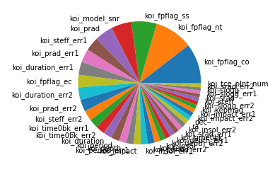

# Machine Learning - Exoplanet Exploration

## Background

This project is to study the NASA Kepler space telescope data based on a planet-hunting mission. I created several machine learning models that are capable of classifying candidate exoplanets from the raw dataset.

### Preprocess the Data

* Preprocess the dataset before fitting the model.
    - unnecessary columns have removed
    - all rows containing NaN are removed
    - Data is 25/75 split into a training and test set.
    - Numerical data is scaled accordingly (MinMaxScaler)
    
* Perform feature selection and remove unnecessary features.
    - The Randomforest model (first pie chart) shows no significant features, while decision tree (second pie chart) shows 4 outstanding features among the 40 features within the study.  
    
    
    - The SVM, Random Forest and Deep Learning models use tree and randomforest to sort the features based on feature_importance, but none of the features were removed for model fitting. It is better to overfit a model than under fit.
    - The accuracy of the KNN model is below 0.85 when k=19, thus, a feature selection is applied before model fitting; the best score is then above 0.85 with k=15 and weights = 'uniform'

### Tune Model Parameters

* Use `GridSearch` to tune three classification model parameters.
    - Uses GridSearch to find the best parameters for all three models
    - The tuned model is used to make the final exoplanet prediction
    - All models score greater than 85% accuracy on test data.

### Results

* SVM model: Best Score = 0.8886 (C=1000, gamma=0.1 ,kernel=rbf )
* Random Forest model: Best Score = 0.8930 (criterion=entropy, n_estimators=1000)
* KNN model: Best Score = 0.8602 (with 4 features, k=15,  weights=uniform)
* Deep Learning model: Loss = 0.2539 / Accuracy = 0.8993 |100 training epochs * 100 training epochs

- - -

© 2021 Trilogy Education Services, LLC, a 2U, Inc. brand. Confidential and Proprietary. All Rights Reserved.